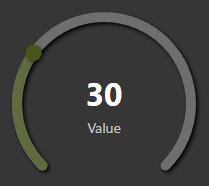

> 🌐 [English](../../en/widgets/radial-slider-widget.md) | **Deutsch**

# Radial Slider Widget

Das Radial Slider Widget ist ein kreisförmiger Bogenschieberegler für numerische Datenpunkte. Es funktioniert wie das normale Slider Widget, aber der Benutzer zieht entlang einer kreisförmigen Bahn statt einer geraden Linie. Es eignet sich perfekt für Thermostat-Kacheln, Lautstärkeknöpfe oder jede Steuerung, bei der ein rundes Drehregler-Element zum Design passt.

---

## Widget hinzufügen

1. Ziehe **Radial Slider** aus der Widget-Liste **inventwo design** auf deine Ansicht.
2. Passe die Größe des Widgets an — es wird als Quadrat gerendert; die Widget-Größe bestimmt die Reglergröße.
3. Klicke auf **Objekt-ID** und wähle deinen numerischen Datenpunkt. Min, Max und Step werden automatisch aus der Objektdefinition übernommen.
4. Passe **Startwinkel** und **Endwinkel** an, um die Bogenform zu definieren.
5. Gestalte Schiene und Regler in den Gruppen **inventwo - Radial track** und **inventwo - Radial thumb**.

---

## Einstellungen

### Common

| Einstellung | Beschreibung |
|-------------|--------------|
| **Objekt-ID** | Der Datenpunkt zum Lesen und Schreiben. Min, Max und Step werden bei der Auswahl einer OID automatisch aus der Objektdefinition befüllt. |
| **Mindestwert** | Der Wert am Anfang des Bogens. Standard: 0. |
| **Maximalwert** | Der Wert am Ende des Bogens. Standard: 100. |
| **Schritt** | Um wie viel sich der Wert pro Schritt ändert. Standard: 1. |
| **Startwinkel** | Der Winkel (0–360°), an dem der Bogen beginnt. 0° ist oben, Winkel steigen im Uhrzeigersinn. Standard: 225 (unten links). |
| **Endwinkel** | Der Winkel (0–360°), an dem der Bogen endet. Standard: 135 (unten rechts). Zusammen mit dem Standard-Startwinkel ergibt das die klassische "270°-Drehregler"-Form. |
| **Wert anzeigen** | Zeigt den aktuellen numerischen Wert in der Mitte des Reglers an. |
| **Bezeichnung anzeigen** | Zeigt eine Textbeschriftung unterhalb des Werts in der Mitte an. Nur sichtbar, wenn ein Beschriftungstext eingegeben wurde. |
| **Bezeichnung** | Der Text, der als Mittelbeschriftung angezeigt wird, z. B. `°C` oder `%`. Nur sichtbar, wenn **Bezeichnung anzeigen** aktiviert ist. |

---

### inventwo - Radialer Track

| Einstellung | Beschreibung |
|-------------|--------------|
| **Vom Widget** | Alle Track-Einstellungen von einem anderen Radial Slider Widget kopieren. |
| **Spurfarbe** | Farbe des Hintergrundbogens (der vollständige Bogen, der noch nicht erreicht wurde). Unterstützt Gradient-Strings, z. B. `linear-gradient(90deg, #aaa, #444)`. |
| **Track aktive Farbe** | Farbe des gefüllten Bogens (der Teil vom Start bis zum aktuellen Wert). Unterstützt ebenfalls Gradient-Strings. |
| **Spurbreite** | Dicke des Bogens in Pixeln. Standard: 10. |
| **Spurleiste Schatten** | Schlagschatten auf dem Hintergrundbogen. X-Offset, Y-Offset, Unschärfe und Farbe einstellen. |

---

### inventwo - Radialer Daumen

| Einstellung | Beschreibung |
|-------------|--------------|
| **Vom Widget** | Alle Thumb-Einstellungen von einem anderen Radial Slider Widget kopieren. |
| **Daumenfarbe** | Farbe des kreisförmigen Reglers. |
| **Daumengröße** | Durchmesser des Regler-Kreises in Pixeln. Standard: 16. |
| **Regler Schatten** | Schlagschatten auf dem Regler. |

---

### inventwo - Radialer Wert

| Einstellung | Beschreibung |
|-------------|--------------|
| **Wertgröße** | Schriftgröße des mittleren Werts in Pixeln (8–100). Standard: 32. |
| **Wertfarbe** | Farbe des mittleren Werttexts. |
| **Bezeichnungsgröße** | Schriftgröße der mittleren Beschriftung in Pixeln (8–50). Standard: 14. |
| **Bezeichnungsfarbe** | Farbe des mittleren Beschriftungstexts. |

---

## Winkel verstehen

Die Winkel werden im Uhrzeigersinn von oben gemessen (12-Uhr-Position = 0°).

| Winkel | Position auf dem Regler |
|--------|------------------------|
| 0° | Oben (12 Uhr) |
| 90° | Rechts (3 Uhr) |
| 180° | Unten (6 Uhr) |
| 270° | Links (9 Uhr) |

**Beispiel — Klassischer Thermostat-Regler:**
- Startwinkel: 225 (unten links, ca. 7 Uhr)
- Endwinkel: 135 (unten rechts, ca. 5 Uhr)
- Ergibt einen großen Bogen, der von unten links, über die Spitze, nach unten rechts verläuft.

**Beispiel — Rechter Halbkreis:**
- Startwinkel: 270 (links)
- Endwinkel: 90 (rechts)
- Ergibt einen Halbkreis auf der rechten Seite.

---

## Tipps

- **Thermostat-Kachel:** Startwinkel 225, Endwinkel 135, Bezeichnung auf `°C` setzen und mit dem Heizungs-Datenpunkt verbinden. Der Bogen überspannt 270° — der klassische Thermostat-Look.
- **Batterieanzeige:** Startwinkel 180, Endwinkel 0, aktive Farbe auf Grün und Spurfarbe auf Dunkelgrau setzen. Der Bogen füllt sich von links nach rechts, während die Batterie lädt.
- **Stil-Wiederverwendung:** Verwende **Vom Widget**, um Track- und Thumb-Einstellungen auf mehrere Regler zu übertragen.

---

## Siehe auch

- [Slider Widget](slider-widget.md) — dieselbe Steuerung als gerader horizontaler oder vertikaler Schieberegler
