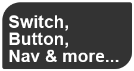

> 🌐 [English](../../en/widgets/universal-widget.md) | **Deutsch**

# Universal Widget

Das Universal Widget ist das vielseitigste Widget im inventwo-Set. Es kombiniert **Interaktionsverhalten**, **visuellen Inhalt** und **zustandsbasiertes Styling** in einer einzigen Kachel. Verwende es, wenn du eine einheitlich aussehende Kachel haben möchtest, die auf deinen Datenpunkt reagiert — und dabei je nach Wert ihr Icon, ihre Farbe, ihren Text oder ihre Form ändert.

**Typische Einsatzbereiche:**
- Lichtschalter-Kachel, die Icon und Farbe beim Einschalten ändert
- Raumnavigations-Schaltflächen, die die aktuell aktive Ansicht hervorheben
- Schaltfläche, die eine Detailansicht in einem Dialog-Overlay öffnet
- Reine Statusanzeige-Kachel mit benutzerdefinierten Icons
- RGB-Farbwähler, eingebettet in eine Kachel
- Analoguhr-Kachel auf dem Dashboard
- Plus/Minus-Schrittschaltflächen

---

## Schnellstart

1. Ziehe **Universal (Switch, Button, Nav, Image & more)** aus der Widget-Liste **inventwo design** auf deine Ansicht.
2. Wähle einen **Type** — das ist die wichtigste Einstellung und legt fest, was beim Klick auf die Kachel passiert. Siehe [Interaktionstypen](universal/interaction-types.md).
3. Klicke auf **Object ID** und wähle den Datenpunkt aus (wenn dein Typ einen Wert liest oder schreibt).
4. Wähle einen **Content type**, um festzulegen, was in der Kachel angezeigt wird (Icon, Bild, Text, eingebettete Ansicht usw.). Siehe [Inhaltstypen](universal/content-types.md).
5. Konfiguriere den Standardzustand in der Gruppe **Default state** — Hintergrund, Farben, Text, Icon.
6. Füge weitere Zustände in den **State**-Gruppen hinzu, um das Aussehen der Kachel je nach Datenpunktwert zu ändern.
7. Gestalte die Kachel (Form, Rahmen, Schatten usw.) in den inventwo-Style-Gruppen. Siehe [Styling und Formen](universal/styling-and-shapes.md).

---

## Grundkonzepte

### Type (Interaktionsverhalten)
Was passiert, wenn du auf die Kachel klickst. Optionen: Switch, Button, Nav, Read only, View in dialog, Increase/decrease value, Send HTTP request. → [Detaillierte Erklärung](universal/interaction-types.md)

### Mode
- **Single button**: Eine Kachel, die jeweils einen einzelnen Zustand anzeigt.
- **Separated buttons**: Jeder Zustand wird als eigene anklickbare Schaltfläche dargestellt, nebeneinander angeordnet. Nützlich für Mehrfach-Optionsauswahlen (ähnlich wie die frühere Radio-Button-Liste).

### States (Zustände)
Das Universal Widget unterstützt mehrere visuelle Zustände. Jeder Zustand wird ausgelöst, wenn der Datenpunktwert einer von dir definierten Bedingung entspricht. Beispiel: Zustand 1 = Icon einer leuchtenden Glühbirne bei Wert `true`, Zustand 2 = Icon einer dunklen Glühbirne bei Wert `false`.

Der **Default state** (Zustand 1) wird immer angezeigt, wenn keine andere Zustandsbedingung zutrifft oder kein OID gebunden ist.

### Content Type (Inhaltstyp)
Was innerhalb der Kachel gerendert wird. Optionen: Icon, Image, Text/HTML, View in widget, Color picker, Analog clock. → [Detaillierte Erklärung](universal/content-types.md)

### From Widget (Stil-Wiederverwendung)
Die meisten Style-Gruppen haben ein **From widget**-Feld. Wähle ein anderes Universal Widget aus, und alle Einstellungen dieser Gruppe werden von dort übernommen. So hältst du viele Kacheln optisch konsistent, ohne jede einzeln konfigurieren zu müssen.

---

## Detailseiten

- [Interaktionstypen](universal/interaction-types.md) — Switch, Button, Nav, Dialog, HTTP und mehr
- [Inhaltstypen](universal/content-types.md) — Icon, Image, HTML, View in widget, Color picker, Analoguhr
- [Styling und Formen](universal/styling-and-shapes.md) — Alle Style-Gruppen, Formen, Klick-Feedback

---

## Siehe auch

- [Switch Widget](switch-widget.md) — einfacherer Ein/Aus-Schalter
- [Checkbox Widget](checkbox-widget.md) — einfachere Checkbox-Steuerung
- [Dropdown Widget](dropdown-widget.md) — zum Auswählen aus einer States-Liste
