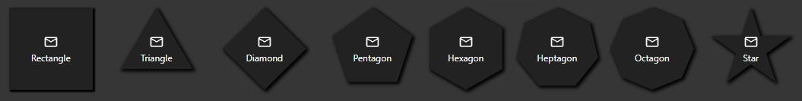

> 🌐 [English](../../../en/widgets/universal/styling-and-shapes.md) | **Deutsch**

# Universal Widget — Styling und Formen

Das Universal Widget bietet umfangreiche Styling-Optionen, die alle direkt in der VIS-2-Editor-Seitenleiste konfiguriert werden. Styles sind in benannte Gruppen organisiert. Die meisten Gruppen haben ein **Vom Widget**-Feld, mit dem du Einstellungen von einem anderen Universal Widget kopieren kannst.

---

## Zusammenspiel von Zuständen und Styling

Die Gruppe **Default state** und jede nummerierte **State**-Gruppe legen fest, wie die Kachel aussieht, wenn ein bestimmter Datenpunktwert aktiv ist. In jedem Zustand setzt du:

- **Hintergrund**-Farbe
- **Inhaltsfarbe** (Icon-Einfärbung, Bildfilter)
- **Textfarbe**
- **Rahmenfarbe**
- **Äußere / innere Schatten**-Farben
- **Inhaltsblinkintervall** (Blinkgeschwindigkeit in ms — 0 = kein Blinken)
- **Klick deaktivieren wenn aktiv** — Wenn für einen Zustand aktiviert, wird ein Klick auf die Kachel ignoriert, solange dieser Zustand aktuell aktiv ist. Nützlich für Navigationskacheln (verhindert erneutes Klicken auf die bereits aktive Ansicht) oder Mehrfach-Optionsselektoren (verhindert das erneute Schreiben desselben Werts). Nicht verfügbar für den Typ **Read only**.
- **Spiegel** — Zustandsabhängige Spiegel-Überschreibung: **Standard (von Inhalt)** verwendet die globale Einstellung aus der Inhalt-Stilgruppe; **Ja** erzwingt gespiegelten Inhalt in diesem Zustand; **Nein** erzwingt nicht gespiegelten Inhalt.
- Das Icon, Bild, den Text oder die eingebettete Ansicht, die angezeigt werden soll

Die Gruppe **inventwo Widget Design** (erscheint beim Klicken auf die Zustandsgruppen) ist der Ort, wo diese Farben pro Zustand konfiguriert werden.

---

## Style-Gruppen

### inventwo - Text

Steuert das Aussehen des Textlabels innerhalb der Kachel.

| Einstellung | Beschreibung |
|-------------|--------------|
| **Textdekoration** | Unterstrichen, überstrichen oder durchgestrichen. |
| **Textausrichtung** | Horizontale Ausrichtung des Texts: Start, Center, End. |
| **Rand oben / unten / links / rechts** | Abstand um den Text innerhalb der Kachel. |

Schriftfamilie, -größe, -stärke und -farbe werden in den Standard-VIS-Widget-CSS-Einstellungen und in den **Text color**-Feldern pro Zustand gesetzt.

---

### inventwo - Inhalt

Steuert Größe und Positionierung des Inhalts (Icon, Bild usw.) innerhalb der Kachel.

| Einstellung | Beschreibung |
|-------------|--------------|
| **Inhaltsgröße** | Größe des Icons oder Bilds. Kann ein Pixelwert oder ein Prozentsatz der Kachelgröße sein. |
| **Drehung** | Dreht den Inhalt um einen beliebigen Winkel (Grad). |
| **Spiegel** | Spiegelt den Inhalt horizontal. |
| **Passend skalieren** | *(Nur View in widget)* Skaliert die eingebettete Ansicht herunter, um in die Kachel zu passen. |
| **Fülltyp** | *(Nur Image-Inhalt)* Wie das Bild die Kachel füllt: Contain, Cover, Fill, Repeat. |
| **Position** | *(Nur Image-Inhalt)* Bildposition innerhalb der Kachel. |

---

### inventwo - Ausrichtung

Steuert, wie Inhalt und Text relativ zueinander innerhalb der Kachel angeordnet werden.

| Einstellung | Beschreibung |
|-------------|--------------|
| **Inhalt ausrichten** | Horizontale Ausrichtung des Inhalts-Elements: Start, Center, End, Space between. |
| **Textausrichtung (Ausrichtungsgruppe)** | Vertikale oder horizontale Ausrichtungsposition des Texts. |
| **Reihenfolge umkehren** | Tauscht die Reihenfolge von Inhalt und Text (z. B. Text über Icon statt darunter). |

---

### inventwo - Transparenz

| Einstellung | Beschreibung |
|-------------|--------------|
| **Hintergrundopazität** | Deckkraft des Kachel-Hintergrunds (0 = vollständig transparent, 1 = vollständig undurchsichtig). |
| **Inhaltsopazität** | Deckkraft des Inhalts-Elements (Icon, Bild usw.). |

---

### inventwo - Abstand

Setzt den inneren Abstand der Kachel — den Bereich zwischen dem Kachelrand und ihrem Inhalt.

| Einstellung | Beschreibung |
|-------------|--------------|
| **Innenabstand oben / unten / links / rechts** | Abstand vom Rand der Kachel zum Inhalt darin, in Pixeln. |

---

### inventwo - Rahmenradius

Steuert die Form der Kachelecken. Jede Ecke kann unabhängig eingestellt werden.

| Einstellung | Beschreibung |
|-------------|--------------|
| **Eckentyp** | Wie die Ecken gestaltet werden: **Abgerundet** (Standard — weiche Kurve) oder **Abgeflacht (Fase)** (gerader 45°-Schnitt). |
| **Oben links / Oben rechts / Unten rechts / Unten links** | Größe der Ecke in Pixeln. Bei *Abgerundet* ist das der Kurvenradius; bei *Abgeflacht* die Länge des Fasenschnitts. |

> **Hinweis:** Wenn eine Polygon-Form aktiv ist, haben die Rahmenradius-Einstellungen keine Wirkung. Verwende stattdessen die **Eckenradius**-Einstellung innerhalb der Gruppe **inventwo - Form**.

---

### inventwo - Rahmen

Fügt einen Rahmen um die Kachel hinzu.

| Einstellung | Beschreibung |
|-------------|--------------|
| **Rahmenstil** | Linienstil: None, Solid, Dashed, Dotted, Double, Groove, Ridge, Outset. |
| **Größe oben / unten / links / rechts** | Rahmendicke pro Seite in Pixeln. |
| **Rahmenfarbe** | Standard-Rahmenfarbe (auch pro Zustand in den Default state / State-Gruppen setzbar). |

---

### inventwo - Äußerer Schatten

Fügt einen Schlagschatten außerhalb der Kachel hinzu.

| Einstellung | Beschreibung |
|-------------|--------------|
| **Äußere Schattenfarbe** | Schattenfarbe (Standard-Zustand). Auch pro Zustand in den Zustandsgruppen setzbar. |
| **X-Versatz** | Horizontaler Schatten-Offset in Pixeln. |
| **Y-Versatz** | Vertikaler Schatten-Offset in Pixeln. |
| **Verwischen** | Schatten-Unschärferadius. |
| **Größe** | Schatten-Streuungsgröße. |

---

### inventwo - Innerer Schatten

Fügt einen eingebetteten Schatten innerhalb der Kachel hinzu (erzeugt einen vertieften/gedrückten Effekt).

Gleiche Einstellungen wie beim äußeren Schatten. Eine Farbe pro Zustand kann in den Zustandsgruppen gesetzt werden.

---

### inventwo - Form

Das Form-System ermöglicht es, die Kachel in eine geometrische Form zu beschneiden. Alle Formen außer Rechteck verwenden CSS clip-path, sodass Hintergrund, Rahmen und Schatten weiterhin in der ausgewählten Form erscheinen.

| Einstellung | Beschreibung |
|-------------|--------------|
| **Form** | Die Form der Kachel: Rectangle (Standard, kein Beschneiden), Triangle, Diamond, Pentagon, Hexagon, Heptagon, Octagon, Star, Custom. |
| **Form-Rotation** | Dreht die Polygon-Clip-Form. Unabhängig von der Inhaltsrotation. |
| **Eckenradius** | Rundet die Ecken von Polygon-Formen ab. Die Standard-Border-Radius-Einstellung aus **inventwo - Rahmenradius** wird für Polygon-Formen ignoriert — verwende stattdessen diese. |
| **Benutzerdefinierte Polygon-Punkte** | *(Nur Custom-Form)* Kommagetrennte X%/Y%-Paare im Uhrzeigersinn, z. B. `40% 0%, 100% 50%, 40% 100%, 0% 50%`. Das `%`-Zeichen ist optional. Wenn der Pfad ungültig ist, fällt die Kachel auf Rechteck zurück. |

> **Tipp:** Erstelle benutzerdefinierte Polygon-Formen visuell mit dem Tool auf [bennettfeely.com/clippy](https://bennettfeely.com/clippy/) und füge das Ergebnis in **Benutzerdefinierte Polygon-Punkte** ein.

---

### Klick-Feedback

Beim Klicken kann die Kachel kurz zu einer anderen Farbe blinken, um dem Benutzer eine visuelle Bestätigung zu geben, dass der Klick registriert wurde.

| Einstellung | Beschreibung |
|-------------|--------------|
| **Hintergrund** | Hintergrundfarbe während des Drückmoments. |
| **Inhaltsfarbe** | Inhaltsfarbe (Icon) während des Drückmoments. |
| **Textfarbe** | Textfarbe während des Drückmoments. |
| **Rahmenfarbe** | Rahmenfarbe während des Drückmoments. |
| **Äußere Schattenfarbe** | Äußere Schattenfarbe während des Drückmoments. |
| **Innere Schattenfarbe** | Innere Schattenfarbe während des Drückmoments. |
| **Dauer** | Wie lange die gedrückte Farbe in Millisekunden sichtbar ist. |

---

## Stil-Wiederverwendung mit "Vom Widget"

Die meisten Style-Gruppen haben eine **Vom Widget**-Option oben. Wenn du dort ein anderes Universal Widget auswählst, werden alle Einstellungen in dieser Gruppe zur Laufzeit von dem ausgewählten Widget übernommen.

**Verwendung:**
1. Erstelle ein "Master"-Universal Widget und konfiguriere sein Aussehen genau nach deinen Wünschen.
2. Wähle bei allen anderen Kacheln dieses Master-Widget in jedem **Vom Widget**-Feld aus.
3. Wann immer du den Stil des Master-Widgets änderst, aktualisieren sich alle Kacheln, die darauf verweisen, automatisch.

Das ist der empfohlene Ansatz für Dashboards mit vielen optisch konsistenten Kacheln — Stil einmal konfigurieren, überall wiederverwenden.

---

## Zurück zu

- [Universal Widget Übersicht](../universal-widget.md)
- [Interaktionstypen](interaction-types.md)
- [Inhaltstypen](content-types.md)
