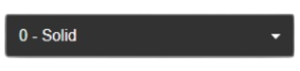

> 🌐 **English** | [Deutsch](../../de/widgets/dropdown-widget.md)

# Dropdown Widget

The Dropdown Widget shows a selectable list of options and writes the chosen value back to a datapoint. The options are loaded automatically from the ioBroker object definition — no manual list maintenance needed. This is ideal for selecting modes, scenes, fan speeds, or any datapoint that has a fixed list of allowed values defined in its object.

---

## How to Add the Widget

1. Drag **Dropdown** from the **inventwo design** widget list onto your view.
2. Click **Object ID** and select a datapoint whose ioBroker object has a `states` list (in the object editor this is the "States" field under the "Common" tab).
3. The dropdown options are loaded automatically. If you see an empty dropdown, the selected object may not have a states list.
4. Optionally enter a **Title** to label the dropdown.
5. Style the widget in the **inventwo - Dropdown** group.

> **What is a states list?** In ioBroker, objects can have a predefined list of allowed values with labels, e.g. `0: "Off"`, `1: "Low"`, `2: "Medium"`, `3: "High"`. The Dropdown Widget reads this list and uses it as the menu options.

---

## Settings

### Common

| Setting | What it does |
|---------|-------------|
| **Object ID** | The datapoint to read and write. Options are loaded from this object's states list. |
| **Show value in label** | When enabled, each option shows the numeric key next to the text, e.g. `1 - Low`. When disabled, only the text label is shown. Default: enabled. |
| **Show text** | When enabled, the text part of the states list is shown. Combine with **Show value in label** to control exactly what appears. Default: enabled. |
| **Read only** | When enabled, the current value is shown as plain text in a styled box — no dropdown arrow, no interaction. |
| **Title** | Optional label displayed above the dropdown, e.g. `Fan speed` or `Mode`. |

**Label display combinations:**

| Show value | Show text | Example label |
|-----------|-----------|--------------|
| ✓ | ✓ | `1 - Low` (default) |
| ✗ | ✓ | `Low` |
| ✓ | ✗ | `1` |

---

### Background conditions

This group lets you change the dropdown's background color depending on the current value. Useful for highlighting critical states (e.g. red when "Error", green when "OK").

| Setting | What it does |
|---------|-------------|
| **Background OID** | By default, the condition is evaluated against the main **Object ID**. Set a different OID here if you want the background to follow a different datapoint. |
| **Number of conditions** | How many color rules to add. Each condition is evaluated in order and the first match wins. |

Each condition has:

| Setting | What it does |
|---------|-------------|
| **Comparison operator** | How to compare the value: Equal, Not equal, Greater, Lower, Greater equal, Lower equal. |
| **Value** | The value to compare against. |
| **Background** | The background color to use when this condition matches. |

---

### inventwo — Dropdown

| Setting | What it does |
|---------|-------------|
| **From widget** | Copy all visual settings from another Dropdown Widget. |
| **Font size** | Text size of the dropdown options and selected value in pixels. |
| **Text color** | Color of the text in the dropdown. |
| **Background** | Default background color of the dropdown. |
| **Highlight color** | Background color when hovering over an option or for the currently selected option. |
| **Border color** | Color of the dropdown border. Changes to the highlight color on hover/focus. |
| **Border width** | Thickness of the dropdown border in pixels. |
| **Border radius** | How round the corners of the dropdown box are in pixels. |
| **Title font size** | Font size for the title label above the dropdown. |
| **Title color** | Color of the title label. |
| **Apply conditional background to title** | When enabled, the title area's background color also changes to match the active background condition color. |
| **Title padding top/bottom/left/right** | Spacing around the title label. |
| **Dropdown shadow** | Drop shadow for the dropdown box. Set X offset, Y offset, blur, spread, and color. |

---

## Tips

- **The dropdown is empty:** Make sure the selected object actually has a states list. Open the ioBroker Admin, go to Objects, find your object, and check if the "States" field is filled in under the "Common" tab.
- **Read-only display:** Enable **Read only** to use the dropdown purely as a display widget — it shows the current value in the styled box without any dropdown behavior.
- **Color feedback:** Use **Background conditions** to make the widget immediately communicate the current state through color, e.g. green for "Running", yellow for "Standby", red for "Error".

---

## See Also

- [Universal Widget](universal-widget.md) — for custom button/tile layouts with per-state styling
- [Table Widget](table-widget.md) — for displaying tabular data
