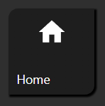
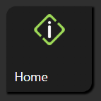
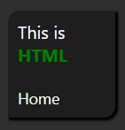
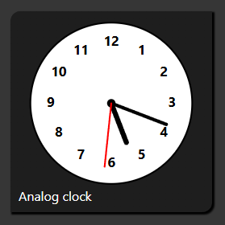

# Universal Widget — Content Types

The **Content type** setting (in the **Common** group) defines what is shown inside the Universal Widget tile. The content and its appearance can be configured separately for each state.

---

## Icon

**Use for:** Symbolic visual representation of a state — a light bulb for on/off, a lock for secure/unlocked, a thermometer for heating, etc.

**How it works:** You select an icon file from the ioBroker icon library (or upload your own). The icon is rendered in the tile and can be tinted to any color.

**Per-state settings (in the Default state / State groups):**
- **Icon** — Select the icon to show in this state.
- **Content color** — The tint color applied to the icon in this state.
- **Content color true** — *(separated buttons / true-value state)* Tint color for the active state.

**Content styling (in the "inventwo - Content" group):**
- **Content size** — Size of the icon in pixels or as a percentage of the tile.
- **Rotation** — Rotate the icon by any angle.
- **Mirror** — Flip the icon horizontally.

---

## Image

**Use for:** Photos, background artwork, custom illustrations, or any image file as the tile's visual content.

**How it works:** You enter a URL or file path to an image, and it is displayed inside the tile.

**Per-state settings:**
- **Image** — URL or path to the image file for this state.
- **Image true** — Image used in the active/true state (for switch-type tiles).

**Image styling (in the "inventwo - Content" group):**
- **Fill type** — How the image fills the tile area:
  - **Contain** — The image fits entirely inside the tile (may leave empty space).
  - **Cover** — The image fills the tile completely (may crop edges).
  - **Fill** — The image is stretched to fill the tile exactly.
  - **Repeat** — The image is tiled (repeated) to fill the area.
- **Position** — Where the image is positioned within the tile (used with Contain).

---

## Text html

**Use for:** Displaying formatted text, values, or simple HTML content inside a tile.

**How it works:** You enter text or HTML markup in the **Text** field. The content is rendered as HTML inside the tile.

**Per-state settings:**
- **Text** — The text or HTML content for this state. You can use `<b>`, `<i>`, `` and similar tags.
- **Text true** — Text content for the active/true state.

**Text styling** is controlled by the **inventwo - Text** group (font size, weight, alignment, decoration, margins).

> **Security note:** Only use trusted content in the Text html field. Do not pass unvalidated user input directly into this field.

---

## View in widget

**Use for:** Embedding another VIS view as the content of a tile — for example a mini-overview or a sub-panel.

**How it works:** Select a VIS view name and it is rendered inside the tile.

**Per-state settings:**
- **View in widget** — The VIS view to embed in this state.
- **View in widget true** — View embedded in the active/true state.

**Content styling:**
- **Scale to fit** — Scales the embedded view down to fit inside the tile. Enable this when the embedded view is larger than the tile size.

---

## Color picker

**Use for:** Interactive color control — controlling RGB lights, LED strips, or any device that accepts color input.

**How it works:** An interactive color picker is rendered inside the tile. The selected color is written to one or more datapoints.

**Settings (in the "Widget content - Color picker" group):**

| Setting | What it does |
|---------|-------------|
| **Object ID (color picker)** | Main datapoint to write the color to (in the format matching your color model). |
| **Oid value 1 / 2 / 3** | Additional datapoints for individual color components (e.g. R, G, B separately). |
| **Color model** | The format of the value written: **HSV**, **HSL**, **RGB**, **CIE**, **Hex**, **Hex 8** (hex with alpha). |
| **Show wheel** | Shows the circular color wheel. |
| **Show box** | Shows the color/saturation box. |
| **Show hue** | Shows the hue slider. |
| **Show Saturation** | Shows the saturation slider. |
| **Show value** | Shows the brightness (value) slider. |
| **Show red / green / blue** | Shows individual R, G, B sliders. |
| **Show Alpha** | Shows the opacity/alpha slider. |
| **Show kelvin** | Shows the color temperature (Kelvin) slider. |
| **Width** | Width of the color picker in pixels. |
| **Handle size** | Size of the color picker handles. |
| **Handle margin** | Margin around the handles. |
| **Components space** | Vertical space between the color picker components. |
| **Border width / Border color** | Adds a border around the color picker components. |
| **Direction** | Layout direction: **Horizontal** or **Vertical**. |

**Tip for RGB lights:** Set **Color model** to **Hex** and connect **Object ID (color picker)** to the color datapoint of your light adapter. Enable only the controls your light supports — e.g. only the wheel for hue and the value slider for brightness.

---

## Analog clock

**Use for:** Dashboard clock tiles showing the current local time.

**How it works:** A live analog clock is rendered inside the tile and updates every second. No datapoint connection is needed.

**Settings (in the "Widget content - Analog clock" group):**

**Clock face:**

| Setting | What it does |
|---------|-------------|
| **Design** | Face style: **Classic** (numbers + long ticks), **Modern** (minimalist ticks), **Minimal** (very clean, no numbers), **Dashes** (tick marks only), **Custom** (configure ticks and numbers manually). |
| **Face color** | Color of the clock face elements (ticks, numbers). |
| **Background color** | Fill color behind the clock face. |

**Custom face settings** (only when **Design** is set to **Custom**):

| Setting | What it does |
|---------|-------------|
| **Tick interval** | Which ticks to show: **Hours only**, **Both** (hours and minutes). |
| **Tick thickness** | Thickness of minute ticks. |
| **Main tick thickness** | Thickness of hour ticks. |
| **Tick length** | Length of minute ticks. |
| **Main tick length** | Length of hour ticks. |
| **Show numbers** | Which numbers to show: **All numbers** (all 12), **Main hours only** (12, 3, 6, 9), **None**. |
| **Number size** | Font size of the hour numbers. |
| **Number offset** | Distance of the numbers from the tick marks. |

**Clock ring:**

| Setting | What it does |
|---------|-------------|
| **Show ring** | Draws a circle around the entire clock face. |
| **Ring thickness** | Thickness of the ring. |

**Hands** (hour, minute, second — each independently):

| Setting | What it does |
|---------|-------------|
| **Show** | Whether this hand is visible. |
| **Design** | Hand style: **Classic** (standard tapered hand), **Modern** (thin rectangular hand), **Arrow** (arrow-head shape). |
| **Color** | Color of this hand. |

---

## Back to

- [Universal Widget Overview](../universal-widget.md)
- [Interaction Types](interaction-types.md)
- [Styling and Shapes](styling-and-shapes.md)
